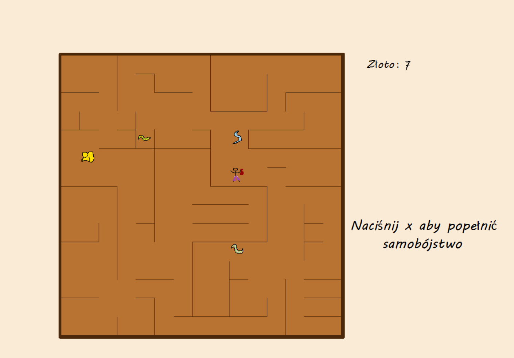

# Gold_fever
## Game in C

This game was created as a final project for programming classes at the university.
The game was written in C using the SDL2 library.

## Graphics

This folder contains all used graphics.

## Dokumentacja

That folder contains documentation in Polish.

## prettyfont

It's the font I used to show scores on the screen.

## main.c, naglowki.h, funkcje.c

There is C code files.
#### I'm still working on this game.
### Thanks for reading.

